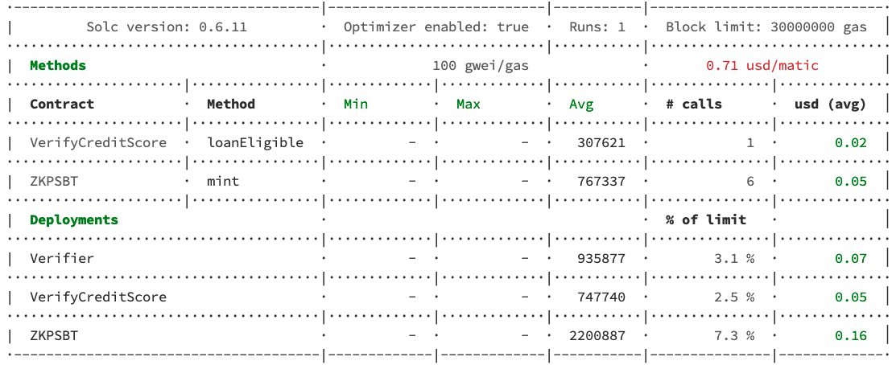

# ZKP Soulbound Token

A template for creating new SBTs inheriting from a SBT smart contracts, using ZKP.

We use [eth-crypto](https://www.npmjs.com/package/eth-crypto) package to encrypt and decrypt the data.

## Install dependencies and deployment

### Preparations

* Set `DEPLOYER_PRIVATE_KEY` to the deployers private key in `.env`
* Set `INFURA_API_KEY` to the Infura API key in `.env`
* Set `COINMARKETCAP_API_KEY` to the CoinMarketCap API key in `.env`, if needed
* Set `ETHERSCAN_API_KEY` to the Etherscan API key in `.env`, if needed
* Set the environment variables in every `.env` file. These variables are used to deploy the smart contracts to the network.

### Install dependencies

Run:
```
yarn install
```

### Build smart contracts

Run:
```
yarn build
```

### Deploy

Run:
```
yarn deploy --network {network}
```

## Contract Deployments

### Deployment addresses

You can see the deployment address of the smart contracts in the [deployments/goerli](deployments/goerli) and [deployments/mainnet](deployments/mainnet) folders. For every deployed smart contract you will find a `<smart_contract>.json` JSON file with the address in the `"address"` field.

## Gas cost



## Zero-Knowledge Proof

Zero-knowledge proof is a method by which one party (the prover) can prove to another party (the verifier) that the prover knows a value x that fulfills some constraints without revealing any information apart from the fact that he/she knows the value x.

### Circom and dependencies setup

#### Install Rust

```
curl --proto '=https' --tlsv1.2 https://sh.rustup.rs -sSf | sh
```

#### Build Circom from source

```
git clone https://github.com/iden3/circom.git
cd circom
cargo build --release
cargo install --path circom
```

#### Install snarkjs

```
npm install -g snarkjs
```

### Compile the circuit

```
cd circuits
circom creditScoreConstraint.circom --r1cs --wasm --sym --c
```

### Run circuit trusted setup

Powers of tau, which is independent of the circuit:
```
snarkjs powersoftau new bn128 12 pot12_0000.ptau -v
snarkjs powersoftau contribute pot12_0000.ptau pot12_0001.ptau --name="First contribution" -v
```

Phase 2, which depends on the circuit:
```
snarkjs powersoftau prepare phase2 pot12_0001.ptau pot12_final.ptau -v
snarkjs groth16 setup creditScoreConstraint.r1cs pot12_final.ptau creditScoreConstraint_0000.zkey
snarkjs zkey contribute creditScoreConstraint_0000.zkey creditScoreConstraint_0001.zkey --name="1st Contributor Name" -v
snarkjs zkey export verificationkey creditScoreConstraint_0001.zkey verification_key.json
```

### Compute the witness

Add the input in the file `input.json` file:
```
{
  "hashData": "0x2ea94e39eedb45eb122224c1dc25809816ea2c29343466c861aa09d1b3936672",
  "ownerAddress": "0x14B2Bab4d1068e742BAf05F908D7b5A00773B0dd",
  "threshold": 40,
  "creditScore": 45
}
```

Then execute:
```
node creditScoreConstraint_js/generate_witness.js creditScoreConstraint_js/creditScoreConstraint.wasm input.json witness.wtns
```

### Generate a proof

Generate a zk-proof associated to the circuit and the witness:
```
snarkjs groth16 prove creditScoreConstraint_0001.zkey witness.wtns proof.json public.json
```

### Verifying a Proof

To verify the proof, execute the following command:
```
snarkjs groth16 verify verification_key.json public.json proof.json
```

### Verifying from a Smart Contract

We need to generate the Solidity code using the command:
```
snarkjs zkey export solidityverifier creditScoreConstraint_0001.zkey ../contracts/verifier.sol
```

The `Verifier` has a `view` function called `verifyProof` that returns `TRUE` if and only if the proof and the inputs are valid. To facilitate the call, you can use `snarkJS` to generate the parameters of the call by typing:

```
snarkjs generatecall
```
